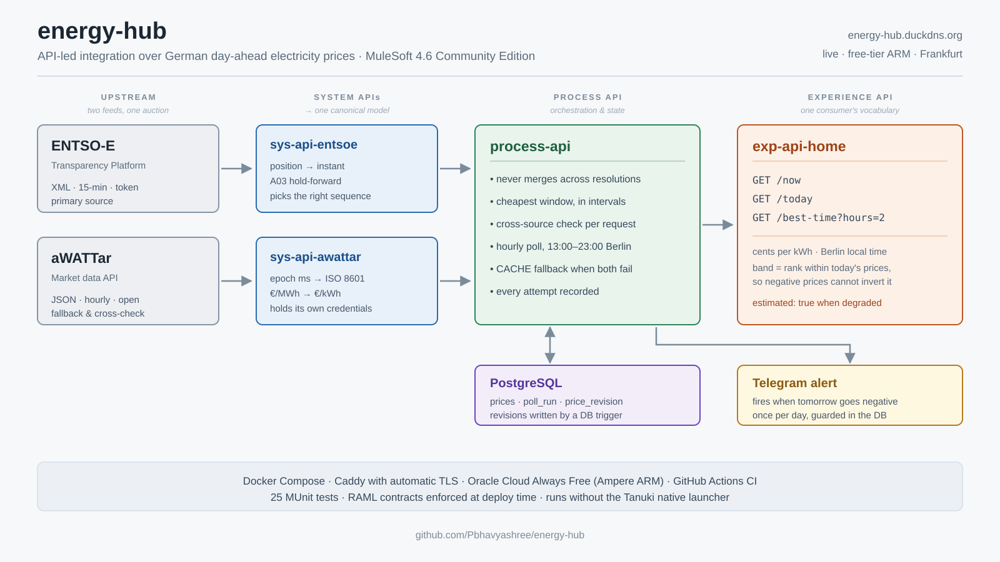

# energy-hub

An API-led integration layer over German day-ahead electricity prices, built on
MuleSoft and running on the Mule runtime Community Edition.

Two independent upstreams, one canonical model, four applications, deployed and
polling on a schedule.



### Live

**[energy-hub.duckdns.org](https://energy-hub.duckdns.org)** — today's prices by
the quarter hour, banded, with the best window still ahead of you.

The page is static and calls the experience API from the browser. The API keeps
returning JSON; an API that serves HTML to please a link preview stops being an
API.

```bash
curl https://energy-hub.duckdns.org/api/exp/home/v1/now
```

```json
{
  "at": "23:15",
  "cents": 16.76,
  "band": "NORMAL",
  "verdict": "Nothing unusual either way.",
  "estimated": false
}
```

| Endpoint | What it answers |
|---|---|
| `/api/exp/home/v1/now` | Is now a good time to use power? |
| `/api/exp/home/v1/today` | The whole day in local time, every interval banded |
| `/api/exp/home/v1/best-time?hours=2` | When to run an appliance |
| `/api/prc/energy/v1/health` | When each upstream last actually succeeded |
| `/` | All of the above, for a person rather than a program |

Running on an Oracle Cloud Always Free ARM instance in Frankfurt. Total hosting
cost: nothing.

---

## Status

| Component | State |
|---|---|
| **aWATTar system API** | Complete — spec-driven routing, canonical mapping, 5 MUnit tests |
| **ENTSO-E system API** | Complete — built against real captured responses, 6 MUnit tests |
| **Process API** | Complete — orchestration, cheapest-window, cross-source check, persistence, scheduled poll |
| **Experience API** | Complete — household view, 6 MUnit tests |
| **Front end** | Live — static page at the domain root, calls the experience API |
| **Negative-price alerting** | Live — Telegram, idempotent per day and zone |
| **Deployment** | Live — Docker Compose, TLS, scheduled polling |

---

## Why the layers are where they are

| Layer | Owns | Never contains |
|---|---|---|
| **System** | Upstream credentials and dialect, mapping to canonical types | Caching, aggregation, business rules |
| **Process** | Orchestration, source selection, price-window logic, persistence | Request shaping for a specific client |
| **Experience** | Response shaping for one consumer, and the judgements that consumer needs | Anything a second consumer would also need |

The test for whether a boundary is real: adding a third upstream should mean
writing one new system API and changing one route. If it forces a change in the
experience layer, the boundary leaked.

The canonical RAML library lives once, at `shared-specs/`, and is copied into
each module at build time. Per-module copies are generated and gitignored, so
the two system APIs cannot drift apart on the model they both speak.

**The experience API deliberately does not import it.** A household app should
not be coupled to the shape of a wholesale market document — if a canonical
field is renamed, the process layer changes and that spec does not. That
absence is the clearest evidence the layering is structural rather than
decorative.

---

## The canonical model

```json
{
  "startsAt": "2026-09-24T22:00:00Z",
  "endsAt": "2026-09-24T22:15:00Z",
  "resolutionMinutes": 15,
  "pricePerMWh": 196.99,
  "pricePerKWh": 0.19699,
  "currency": "EUR",
  "source": "ENTSOE"
}
```

`source` is deliberately part of the model. When the process layer falls back to
the secondary feed or to stored data, the consumer can see where a number came
from — and at what resolution.

---

## Two upstreams, one auction

Both system APIs publish the same EPEX SPOT day-ahead auction, which makes them
a check on each other.

**aWATTar** serves plain JSON, hourly, no authentication.

**ENTSO-E** serves `Publication_MarketDocument` XML, quarter-hourly, and is
considerably less forgiving:

- prices carry no timestamps — each `Point` has a *position*, and the instant is
  `periodStart + (position − 1) × resolution`
- `curveType` is **A03**, so positions whose price repeats the previous one are
  omitted entirely and must be held forward
- a single response contains **two** `TimeSeries` covering identical intervals,
  one per auction sequence — and document order does not match sequence order,
  so taking the first gives you the wrong auction
- "no data published" arrives as HTTP **200** with an `Acknowledgement`
  document, not a 404

### Verified against an independent source

The rule for choosing between the two auction sequences came from a forum
thread, not official documentation — so it was checked rather than trusted:

```
ENTSO-E sequence 1, first four quarter-hours of 2026-09-25:
  196.99 + 184.40 + 175.79 + 170.59 = 727.77 ÷ 4 = 181.9425

aWATTar, same hour, hourly resolution:            181.94
```

An exact match. Sequence 2 opens at 192.55 and does not agree.

That check is now an MUnit assertion *and* a runtime comparison: on every
request the process layer verifies each aWATTar hour against the mean of its
four ENTSO-E quarters, and logs a WARN on divergence. The cheapest monitoring
available, since it needs no extra dependency.

---

## Resolution: never merged

ENTSO-E publishes quarter-hourly, aWATTar hourly. Three options:

| Option | Why not |
|---|---|
| Downsample ENTSO-E to hourly | Throws away the 15-minute detail, which is exactly where negative-price spikes live |
| Upsample aWATTar to quarter-hourly | Fabricates detail: asserts each quarter equals the hourly mean, which is demonstrably false |
| **Never merge across resolutions** | Chosen |

ENTSO-E is primary at its native resolution; aWATTar answers only when ENTSO-E
gave nothing, and the response is marked `degraded`. `cheapestWindow` therefore
works in **intervals** — four hours is 16 at PT15M and 4 at PT60M, with no
special case — and returns null rather than an average when resolutions are
mixed. Refusing to guess is a feature, and there is a test for it.

The first real response justified the decision: the cheapest four-hour window
began at **11:30 Berlin**, which is only expressible at quarter-hourly
resolution.

---

## What the experience layer decides

An experience API exists to serve one consumer in that consumer's vocabulary.
This one serves a household app: cents per kWh (the unit on a German bill),
Berlin wall-clock (because "14:15" is actionable and "12:15Z" is not), bidding
zone as configuration rather than a parameter, and no mention of settlement
resolution or auction sequences.

The one judgement it makes is what "cheap" means — **rank within today's own
prices, in terciles**:

| Rule | Why not |
|---|---|
| Fixed threshold ("under 5 ct") | Stale the first time the market moves |
| Percentage of the day's mean | Breaks on negative prices, which German day-ahead produces regularly. As the mean nears zero the ratio explodes; once negative, the comparison inverts and the cheapest hours get labelled EXPENSIVE |
| **Rank, in terciles** | Ordinal, so it survives both |

There is a test for exactly that: a day with a mean of −0.043 EUR/kWh, asserting
that the rejected rule reports the day's *cheapest* hour as above average while
the rule in use still labels it CHEAP.

What it does **not** hide: when data came from the fallback, the response says
`estimated: true`. Simplifying is this layer's job; overstating confidence is
not.

---

## Running it

Requires JDK 17 and Maven 3.9+. No Anypoint subscription and no Anypoint
Studio — these are plain Maven builds.

```bash
cd process-api        # or any other module
mvn clean test        # no network required; every test mocks its upstream
mvn clean package     # produces target/*-mule-application.jar
```

### Locally, against a standalone runtime

```bash
MULE_HOME=~/mule-standalone-4.6.0 ./deploy/run-mule.sh
```

### Deployed

```bash
cd deploy
cp .env.example .env     # ENTSO-E token, database password, domain
docker compose up -d --build
```

`deploy/server-setup.sh` provisions a fresh Ubuntu host: Docker, firewall rules,
repository.

---

## Mule CE without the Tanuki wrapper

`bin/mule` launches through the Tanuki Java Service Wrapper, which ships
**native** binaries per platform. The 4.6.0 distribution contains x86, ia-64,
ppc-64, sparc and macosx-ppc builds — and no `aarch64`, because it bundles
Tanuki 3.2.3, which predates ARM servers.

That matters because free compute is ARM. Oracle's always-free tier is 4 OCPUs
and 24GB of Ampere against 1/8 of an OCPU and 1GB for its x86 shape, and four
Mule applications do not fit in the latter.

Mule 4.6 treats the wrapper as a pluggable class:

```
-Dmule.bootstrap.container.wrapper.class=
    org.mule.runtime.module.boot.internal.MuleContainerBasicWrapper
```

`MuleContainerWrapperProvider` loads whatever class that property names and
checks only that it implements `MuleContainerWrapper`. The stock distribution
ships a second, pure-Java implementation, and `org.mule.boot.api` exports the
package to the module holding the entry point. Selecting it removes the only
architecture-dependent component in the boot path.

Captured in `deploy/run-mule.sh`, with the JPMS flags that `JpmsUtils` validates
at boot. It is also a better container entry point than `bin/mule` on any
architecture: Docker already supervises processes, and a supervisor inside a
container swallows signals.

---

## Built for Mule CE

Community Edition is what makes a permanently-running deployment possible
without a subscription, and it excludes several things most MuleSoft tutorials
assume. Working within those limits shaped the design:

| Not available in CE | What this project does instead |
|---|---|
| `ee:transform` (Transform Message) | `set-payload` with inline DataWeave importing modules from `src/main/resources/modules`. Better for testing — MUnit calls the functions directly. |
| Batch scope | Plain scheduler and `foreach` |
| MUnit coverage | The build gate is pass/fail rather than a percentage |
| API Manager policies | Rate limiting and auth belong in the flow or a reverse proxy — here, Caddy |

---

## Operations

A scheduler polls both upstreams hourly from 13:00 to 23:00 Berlin, writes every
interval to Postgres, and records **every attempt** in `poll_run`. `/health`
reports from that table rather than by calling the upstreams — a health check
that fans out to its dependencies turns one slow upstream into a failing health
check.

`poll_run` distinguishes `NO_DATA` from `FAILED` on purpose: "tomorrow's auction
has not cleared yet" happens every morning and is normal. Three days of
unattended operation showed why that distinction matters — six of ENTSO-E's
non-successes were NO_DATA, so collapsing them would have shown 15 failures
instead of 9, and any alert built on that column would have fired every morning.

`price_revision` gets a row only when a stored price actually changes, written by
a database trigger rather than application code, so no future write path can
forget it.

Negative prices raise a Telegram alert. The guard against sending it twice is a
primary key on `(kind, delivery_day, bidding_zone)` in `alert_sent`: the insert
is attempted first and the message is sent only when it affected a row, so two
overlapping polls cannot both decide they were first.

When both upstreams fail, the process layer serves from the stored data with
`source: CACHE` and `degraded: true` — verified end to end by undeploying both
system APIs.

---

## Design decisions

**Every test mocks its upstream.** The suites never touch the network, so builds
are deterministic and states that are otherwise hard to reach — an auction that
has not cleared, an upstream that is down — can be tested on demand.

**Fixtures are real captured responses.** They started out synthetic, built from
the published schema, and were wrong about the namespace, the curve type, the
resolution and the number of TimeSeries. Every test passed against them anyway,
because fixture and code shared the same wrong assumptions. The one synthetic
fixture that remains — a negative-mean day — is labelled as such and exists to
test a *rule* against a condition the real data cannot express.

**Tests assert on values, not just shape.** Five separate bugs on this project
produced well-formed, plausible, wrong output: a flat price curve from a consumed
stream, cached timestamps shifted by two hours, a whole upstream that silently
stopped being polled, eleven failure records with no failure reason, and the fix
for that last one — which corrected the wrong half of the expression, changed
nothing, and was declared done on reasoning rather than on data. Structural
assertions passed every time.

The fifth is the instructive one. What eventually found it was a query rather
than an argument: rows written by the code path with no string slicing carried
their text, and only the sliced rows were null. The discriminating evidence had
been sitting in the table for five days.

**Errors carry a correlation ID**, and upstream failures are distinguished: 502
for unreachable, 504 for too slow, 404 for "the upstream answered and had
nothing".

---

## What broke along the way

[`NOTES.md`](NOTES.md) is a running log of the failures and their causes — a
non-repeatable stream that turned correct code into a flat price curve, a Host
header that made the same request get two different answers, a logger that took
an entire upstream offline, an error handler that recorded no errors, and the
Enterprise-only features that shaped the architecture.

It is kept as written rather than tidied up afterwards, including the wrong
turns and the time spent on them.
